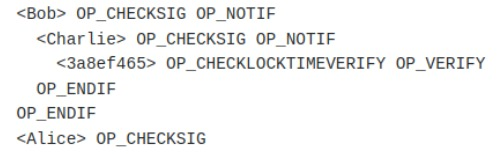

  

# Introducción a Miniscript

## Introducción

En este artículo hablaremos sobre Miniscript, intentado cubrir las ideas principales, las cuales creemos de interés para cualquier persona que esté interesada en empezar a usar esta poderosa herramienta.

La mejor forma de introducirse a una tecnología nueva es, como sabemos, leyendo su documentación, la documentación más completa sin duda es la que podemos encontrar en: <https://bitcoin.sipa.be/miniscript/> , escrita por Pieter Wuille, uno de los creadores de Miniscript, en ella encontramos la definición que utilizaremos en este artículo:

“Miniscript is a language for writing (a subset of) Bitcoin Scripts in a structured way, enabling analysis, composition, generic signing and more”

Cuya traducción literal al español es:

“Miniscript es un lenguaje para escribir (un subconjunto de) Bitcoin Scripts de una manera estructurada, habilitando el análisis, composición, firmado genérico y más”

Por lo tanto Miniscript es:

Un lenguaje para escribir un subconjunto de Bitcoin Scripts.

Primero, comenzaremos comentando sobre algunos de los conceptos que aparecen en la definición.

## Bitcoin Script

Si una divisa ha de ser de alguna utilidad, sin duda es necesario que esta pueda ser transferida.

Por lo tanto es necesario definir un mecanismo que permita tal transferencia. Adicionalmente, tal mecanismo debe poder asegurar el cumplimiento de ciertas condiciones, por ejemplo, que la persona que transfiere la divisa tenga el derecho de hacerlo.

En el caso de Bitcoin, el lenguaje que permite definir (y comprobar) estas condiciones se conoce como Bitcoin Script.

Bitcoin Script es un lenguaje de programación relativamente simple, pero que, como veremos, puede ser difícil de usar.

En las siguientes secciones, siempre que utilzemos la palabra *script* nos referiremos a un Bitcoin Script.

## Estructura

Todo lenguaje implica estructura, la estructura de miniscript, nos dice la definición, habilita entre otras cosas:

1. Análisis
1. Composición

## Análisis

El análisis es uno de esos conceptos que cuya definición es más clara cuando se le asigna un apellido.

Algunos de los análisis que Miniscript facilita son:

- Análisis de condiciones de gasto: ¿Cuáles son las condiciones de gasto de un script?
- Análisis de seguridad: ¿Es posible que un script sea maleable?
- Análisis de costos: ¿Cuál sera el costo de usar un script?

## Composición

La composición es el acto de juntar dos o más cosas para formar una nueva.

En el caso de Miniscript, la composición se refiere a la habilidad de juntar dos o más fragmentos (scripts) para formar uno nuevo.

## Subconjunto

Para bien o para mal la palabra subconjunto trae consigo una connotación intuitiva, y como toda intuición, no siempre está en lo correcto, un ejemplo bastará:

El agua potable es un subconjunto de los líquidos

Mientras que es cierto que el conjunto de los líquidos tiene mucho más que ofrecer que solo agua, es fácil ver porque en nuestro dia a dia nos interesa solo un subconjunto en particular.

Lo mismo es cierto en el caso de Miniscript: el subconjunto que se selecciona es tal que nos permite trabajar con Bitcoin Script sin preocuparnos de, por accidente o intención, "consumir líquidos nocivos para la salud".

Aunque el comentario anterior puede parecer trivial, en realidad, encapsula la motivación principal para usar miniscript:

Usar Bitcoin Script es difícil.

En particular, con Bitcoin Script es difícil realizar los análisis mencionados en la sección anterior, a decir:

- Determinar si un script es *correcto*.
- Determinar si un script es seguro (i.e no es propenso a ser maleable).
- Estimar fees (i.e tamaño de una transacción en el peor de los casos)

Antes de continuar nuestra discusión, conviene introducir la siguiente definición:

**Condición de gasto:** es el conjunto de condiciones mínimas que, al cumplirse, permiten usar con éxito un UTXO en una transacción

Por ejemplo:

- La condición (única) de gasto de una wallet single-sig es la firma del dueño de dicha wallet.
- La condición (uńica) de gasto de una wallet musltisg 2 de 2, es la firma de las dos llaves involucradas.
- Una (de dos en total) condición de gasto de una wallet multisig 1 de 2, es la firma de una de las llaves involucradas

Mientras que algunos de los puntos, como el de seguridad, pueden (y muchas veces son) minimizados por restricciones a nivel de policy, Miniscript soluciona un problema más general:

dado un Bitcoin Script, ¿Es posible, por medio de un análisis simple, determinar todas las posibles condiciones de gasto?

La respuesta es, para la mayoría de nosotros: No.

Para convencernos, veamos el siguiente ejemplo:

Miniscript Policy **(A)**:

and(pk(Alice),or(pk(Bob),or(9@pk(Charlie),after(1710526010))))

Bitcoin Script **(B)**:

  

Invitamos al lector a analizar por un momento la expresión **(A)**.

Asumiendo que una condición es de gasto, en el contexto de Miniscript, si toda la expresión, evaluada lógicamente, toma el valor de verdadero, debe resultar fácil convencerse de que las condiciones de gasto son:

- Firma de Alice y Firma Bob
- Firma de Alice y Firma Charlie
- Firma de Alice y el tiempo especificado (1710526010 unix time) ha transcurrido.

Si las condiciones de gasto que mencionamos son ciertas, se sigue que:

- Los operadores *and* y *or* tienen un comportamiento similar al de sus homónimos lógicos (en caso de duda consulte las tablas de verdad para conjunciones y disyunciones)

- Cada uno de sus elementos debe poder ser evaluado a un booleano (verdadero o falso)

Sería incorrecto afirmar que las expresiones **(A)** Y **(B)** son equivalentes (recordemos nuestra breve digresión sobre subconjuntos), pero las *condiciones de gasto* expresadas en miniscript se conservan al pasar (con la ayuda de un compilador) de **(A)** a **(B)**.

## ¿Dos Miniscripts?

Probablemente el lector habrá notado que en la sección anterior nos hemos referido a la expresión **(A)** como **Miniscript Policy** y no como **Miniscript**.

La razón es que son dos lenguajes diferentes.

La siguiente expresión **(C):**

and_v(or_c(pk(Bob),or_c(pk(Charlie),v:after(1710526010))),pk(Alice))

Es el Miniscript que el Miniscript Policy **(A)** genera.

Examinemos de nuevo **(A)**:

and(pk(Alice),or(pk(Bob),or(9@pk(Charlie),after(1710526010))))

Notemos que las expresiones son muy similares, solo se eliminan algunas cosas de **(A),** como ese extraño ‘9@’ (del que hablaremos en la siguiente sección), se agregan otras como el  ‘v:’ y a los ‘and’ y ‘or’ se les agrega un par de caracteres (en realidad son tipos y modificadores).

Mientras que no entraremos a detalles sobre lo que significa cada uno de los cambios que ocurren cuando se pasa de **(A)** a **(C)**, vale la pena mencionar cómo ocurre esta transformación:

El Miniscript **(C)** se obtiene al compilar el Miniscript Policy **(A)**

Naturalmente, el lector puede pensar que la razón de existir estos dos lenguajes es solo para evitarnos el trabajo de agregar todos esos caracteres (aparentemente necesarios) que aparecen en **(A)**, la razón resulta ser más fundamental:

Existen diferentes formas (Bitcoin Scripts) de representar una misma condición de gasto.

Para ilustrar el problema, tomemos una condición de gasto simple: pk(A)

Podemos decir que existen al menos cuatro formas (opcodes) de comprobar esta condición:

1. OP\_CHECKSIG
1. OP\_CHECKSIGVERIFY
1. OP\_CHECKMULTISIG
1. OP\_CHECKMULTISIGVERIFY

En realidad basta con darnos cuenta que existen muchas formas de combinar los operadores 'and' y 'or' para expresar una condición dada.

Si hay varias opciones disponibles, tenemos la libertad de elegir ciertos parámetros de intéres para facilitar la elección, uno de ellos, del que hablaremos a continuación es: optimización.

## Probabilidades y Optimización

Anteriormente mencionamos que para determinar las condiciones de gasto es útil pensar en que todos los elementos dentro de los operadores and y or deben poder ser evaluados a un booleano. Si asumimos que pk(A) es verdadero cuando se cuenta con una firma válida de A y falso cuando no, surge la pregunta:

¿Qué significa ‘N@pk(A)’ donde N es un número entero?

Empezaremos aclarando que ‘N@’ **NO** es un operador sobre el booleano pk(A):

N@pk(A) es verdadero si pk(A) es verdadero y falso si pk(A) es falso, sin importar el valor de N.

‘N@’ es la notación para asignar a pk(A) una probabilidad relativa respecto a las otras condiciones que aparecen dentro de un mismo ‘or’.

Por lo tanto en la expresión **(A),** la presencia de ‘9@pk(Charlie)’ es para comunicarle al compilador, que la condición ‘pk(Charlie)’ es 9 veces más probable que la condición ‘after(1710526010)’.

Pero, ¿de qué sirve asignar probabilidades?

Como mencionamos en la sección anterior, dado un conjunto de posibles elecciones, nos conviene escoger aquella que, entre otras cosas, sea óptima.

Decimos que una elección es óptima si, al incluirla, el tamaño del Script resultante es el menor.

Al asignar probabilidades podemos comunicarle al compilador que una rama es más probable (o no) que las otras, en otras palabras, le decimos que le dé prioridad a optimizar ( reducir el tamaño) de la rama que es más probable, a costa de posiblemente incrementar el de la menor probabilidad.

## Conclusión

En este artículo hemos hablado un poco sobre la motivación para usar miniscript, así como de algunas de sus ideas principales, invitamos al lector a leer la documentación oficial si le interesa una introducción con mayor detalle.

En siguientes publicaciones hablaremos sobre Taproot y cómo se puede usar en conjunto con Miniscript.

Autor:

 Armando Medina
